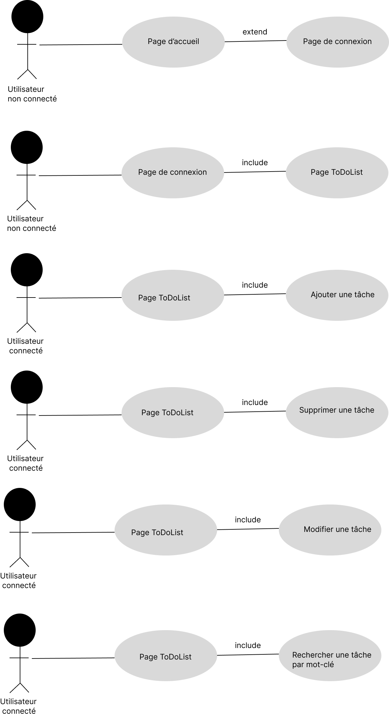
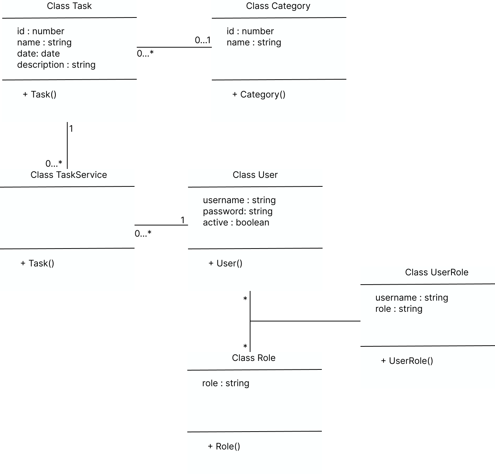

<h1>Expression des besoins</h1>

Application de gestion de tâches à faire, à savoir une TodoList. 
L'application doit être simple pour permettre à l'utilisateur connecté
d'ajouter, supprimer, mettre à jour, ainsi que de rechercher une tâche à faire,
classée ou pas par catégorie. 
Quant à l'utilisateur non authentifié, il aura accès à la page d'accueil du site
avec pour exemple un ensemble de tâches fictives. 
Une tâche doit être définie par : nom, date, description et toute autre information
pertinente.

<h4>Use case : </h4> 

<h4> Class Diagram : </h4>

<h1>Spécifications fonctionnelles</h1>

Pour le visiteur du site, l'appli permet: 
.Afficher la page d'accueil qui montre des exemples de tâches. 
.Se connecter 
Pour l'utilisateur connecté, l'appli permet en plus:  
.Afficher la page des tâches personnalisées et leurs catégories 
.Ajouter une tâche  
.Supprimer une tâche 
.Modifier une tâche 
.Rechercher par mot-clé 
.Sélectionner une catégorie spécifique 

<h1>Spécifications techniques</h1>

-> Spring Boot 2.6.0/Spring Data Jpa Hibernate/Spring Mvc/Thymeleaf/Lombok 
-> Java 11/IntelliJ Community/SGBD MariaDB/BootStrap

